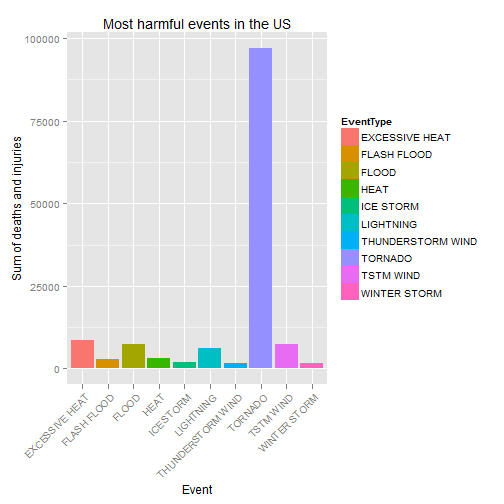
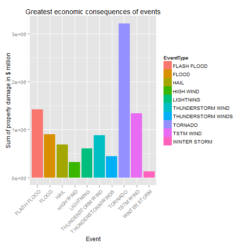

# Harmful events and their economic consequences caused by Storm and severe weather events in the US based on NOAA Storm Database(Coursera repdata-002 Assigment 2)  
----
----


The analysis based on Storm and severe events that have the biggest health and economic consequences in the US.
We can say after the analysis the most harmful events in the US are caused by tornados. In tornados **96979** people died or injured and **$ 3212258.2 million** property damage caused.

 
----
----

## Data Processing
1. Loading repdata-data-StormData.csv.bz2
2. Filter and aggregation
  * Aggregate events by Event types and sum the number of deaths and injuries
  * Aggregate events by Event types and sum the property damage variable
3. Sort the results by the sum variable descending

----
Loading ggplot2 for plots

```r
library(ggplot2)
```


Loading the data

```r
stormData <- read.csv(bzfile("data/repdata-data-StormData.csv.bz2"))
```

## Summary of Deaths in events

```r
summary(stormData$FATALITIES)
```

```
##    Min. 1st Qu.  Median    Mean 3rd Qu.    Max. 
##       0       0       0       0       0     583
```

## Summary of Injuries in events

```r
summary(stormData$INJURIES)
```

```
##    Min. 1st Qu.  Median    Mean 3rd Qu.    Max. 
##     0.0     0.0     0.0     0.2     0.0  1700.0
```

## Summary of Property damage in events

```r
summary(stormData$PROPDMG)
```

```
##    Min. 1st Qu.  Median    Mean 3rd Qu.    Max. 
##       0       0       0      12       0    5000
```


```r
# Aggregation by event type and sum deaths and injuries
harmfulEvents <- aggregate(FATALITIES + INJURIES ~ EVTYPE, data = stormData, 
    FUN = sum)
# more talkable col names
colnames(harmfulEvents) <- c("EventType", "Sum")
# Sorting and top10
harmfulEvents.summary <- head(harmfulEvents[order(-harmfulEvents$Sum), ], 10)
```

## Results for Top 10 harmful event types in the US(Deaths + Injuries)

```r
print(harmfulEvents.summary)
```

```
##             EventType   Sum
## 834           TORNADO 96979
## 130    EXCESSIVE HEAT  8428
## 856         TSTM WIND  7461
## 170             FLOOD  7259
## 464         LIGHTNING  6046
## 275              HEAT  3037
## 153       FLASH FLOOD  2755
## 427         ICE STORM  2064
## 760 THUNDERSTORM WIND  1621
## 972      WINTER STORM  1527
```


```r
# harmful events plot
ggplot(data = harmfulEvents.summary, aes(x = EventType, y = Sum, fill = EventType)) + 
    geom_bar(stat = "identity") + ylab("Sum of deaths and injuries") + xlab("Event") + 
    ggtitle("Most harmful events in the US") + theme(axis.text.x = element_text(angle = 45, 
    hjust = 1))
```

 

#   
   
----
   
# 
   

```r
# Aggregation by event type and sum property damage
harmfulEventsDamage <- aggregate(PROPDMG ~ EVTYPE, data = stormData, FUN = sum)
# more talkable col names
colnames(harmfulEventsDamage) <- c("EventType", "SumOfDamage")
# Sorting and top10
harmfulEventsDamage.summary <- head(harmfulEventsDamage[order(-harmfulEventsDamage$SumOfDamage), 
    ], 10)
```

## Results for Top 10 harmful event types what caused the greatest economic consequences in the US

```r
print(harmfulEventsDamage.summary)
```

```
##              EventType SumOfDamage
## 834            TORNADO     3212258
## 153        FLASH FLOOD     1420125
## 856          TSTM WIND     1335966
## 170              FLOOD      899938
## 760  THUNDERSTORM WIND      876844
## 244               HAIL      688693
## 464          LIGHTNING      603352
## 786 THUNDERSTORM WINDS      446293
## 359          HIGH WIND      324732
## 972       WINTER STORM      132721
```


```r
# economic consequences plot
ggplot(data = harmfulEventsDamage.summary, aes(x = EventType, y = SumOfDamage, 
    fill = EventType)) + geom_bar(stat = "identity") + ylab("Sum of property damage in $ million") + 
    xlab("Event") + ggtitle("Greatest economic consequences of events") + theme(axis.text.x = element_text(angle = 45, 
    hjust = 1))
```

 


